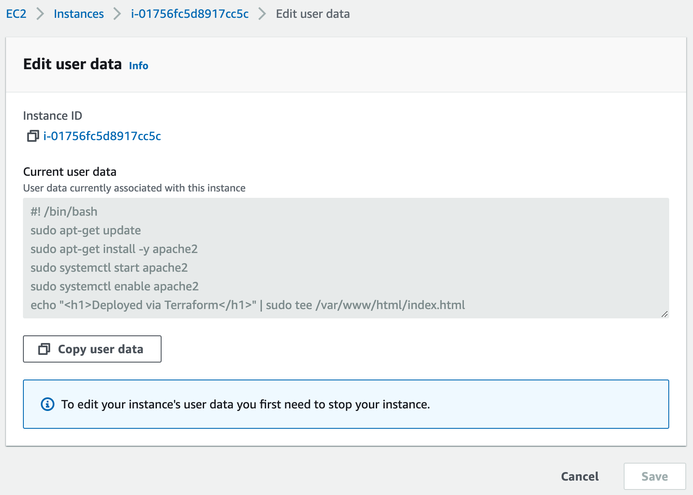

# Solution

Point to the shell script using the `user_data` attribute. To parse the contents of the file, use the `file` function.

```terraform
resource "aws_instance" "app_server" {
  ami           = "ami-077ee47512dc6f3ca"
  instance_type = "t2.nano"
  user_data     = file("install_apache.sh")
}
```

Execute the `apply` command to provision the EC2 instance. The shell script will be executed automatically.

```
$ terraform apply
```

You can find information about the executed shell script commands in the system log of the EC2 instance. Select the UI options _Actions > Instance settings > Edit user data_.

